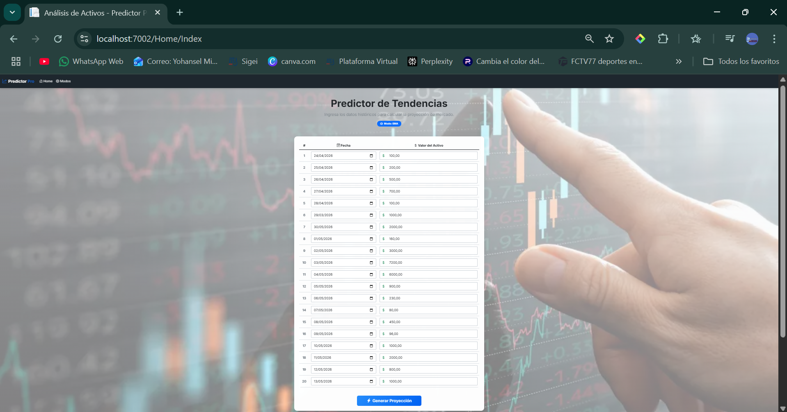
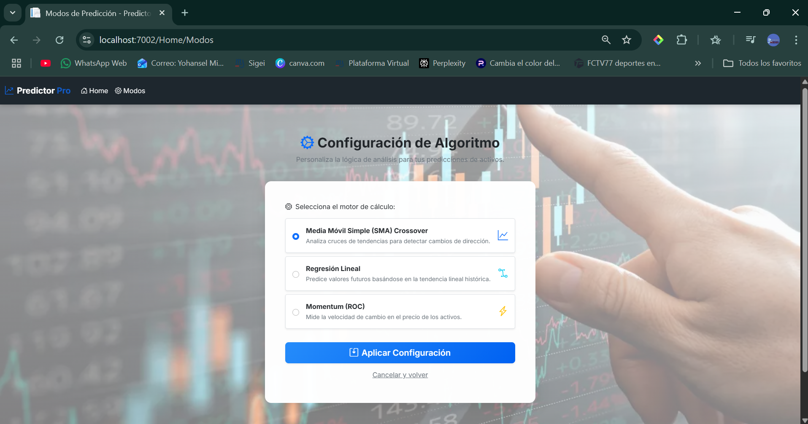
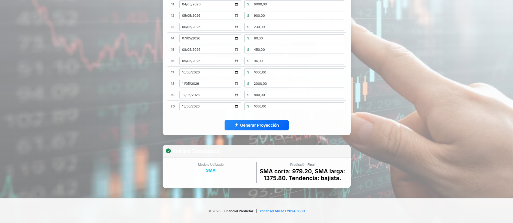
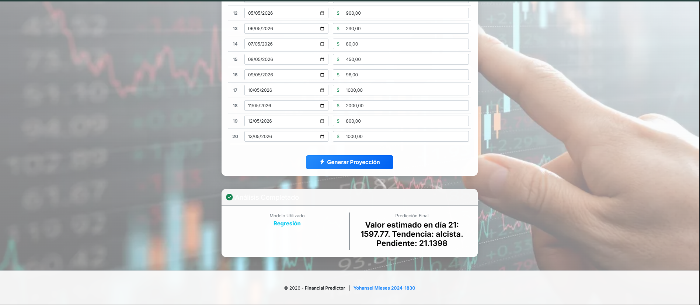
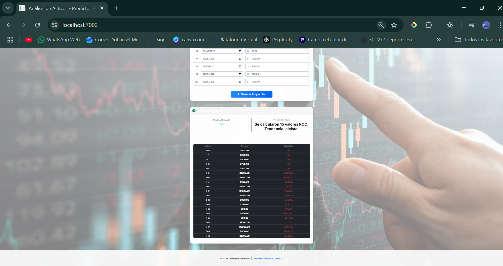

# Asset Trend Predictor (Stocks & Crypto) 📈
**Asset Trend Predictor** es una potente plataforma de análisis cuantitativo desarrollada en **ASP.NET Core 9.0**. El sistema está diseñado para procesar series temporales de activos financieros (acciones y criptomonedas) y proyectar tendencias mediante modelos matemáticos avanzados. La aplicación permite a los usuarios cargar datos históricos de 20 días y aplicar diferentes algoritmos de predicción para determinar si un activo tendrá un comportamiento alcista o bajista.

⚙️ Inteligencia Predictiva y Modos de Análisis
---
El sistema integra tres motores de cálculo especializados que pueden intercambiarse dinámicamente mediante persistencia en memoria (Singleton):

- **Media Móvil Simple (SMA) Crossover:** Utiliza una estrategia de cruce de medias para detectar cambios de tendencia. Compara una SMA corta (5 días) contra una SMA larga (20 días) para identificar señales de compra o venta.
- **Regresión Lineal Simple:** Implementa un modelo estadístico de mínimos cuadrados para calcular la pendiente ($m$) y el intercepto ($b$) de la tendencia. Proyecta el valor esperado para el día 21 y determina la dirección del movimiento.
- **Momentum (Rate of Change - ROC):** Mide la velocidad de variación del precio en periodos fijos de 5 días. Este oscilador de momentum ayuda a cuantificar la aceleración de los cambios de precio en porcentaje.

📂 Arquitectura y Buenas Prácticas
---
El proyecto sigue una estructura desacoplada basada en el patrón **MVC**, cumpliendo con los estándares modernos de desarrollo:

- **Web App Layer (MVC):** Interfaz de usuario intuitiva con formularios validados para la carga de series de tiempo de 20 periodos.
- **Business Logic Layer:** Capa dedicada exclusivamente al procesamiento de los algoritmos matemáticos y lógica de predicción.
- **DTOs & ViewModels:** Implementación estricta de objetos de transferencia de datos para separar la lógica de negocio de la presentación.
- **Persistencia Singleton:** Gestión eficiente del estado para mantener la configuración del modo de predicción seleccionado durante la sesión del usuario.

🔧 Stack Tecnológico
---
- **Framework:** .NET 9.0 / ASP.NET Core MVC.
- **Lenguaje:** C#.
- **Frontend:** Bootstrap 5 para un diseño responsivo y profesional.
- **Algoritmos:** Regresión Lineal, SMA Crossover, Momentum ROC.
- **Componentes:** Data Annotations para validaciones de formularios y persistencia en memoria.

📸 Galería del Proyecto
---
*Sección preparada para visualizar la interfaz y los resultados de las predicciones financieras.*

* **Home - Registro de Datos Históricos (20 días)**
  

* **Selector de Modos de Predicción**
  

* **Resultado: Análisis SMA Crossover**
  

* **Resultado: Proyección por Regresión Lineal**
  

* **Resultado: Histórico de Momentum (ROC)**
  

 👨‍💻 Lead Developer
---
* **Yohansel Mieses** – miesesyohansel@gmail.com
* *Desarrollador enfocado en ingeniería de software, análisis cuantitativo y desarrollo de sistemas escalables en el ecosistema .NET.*
